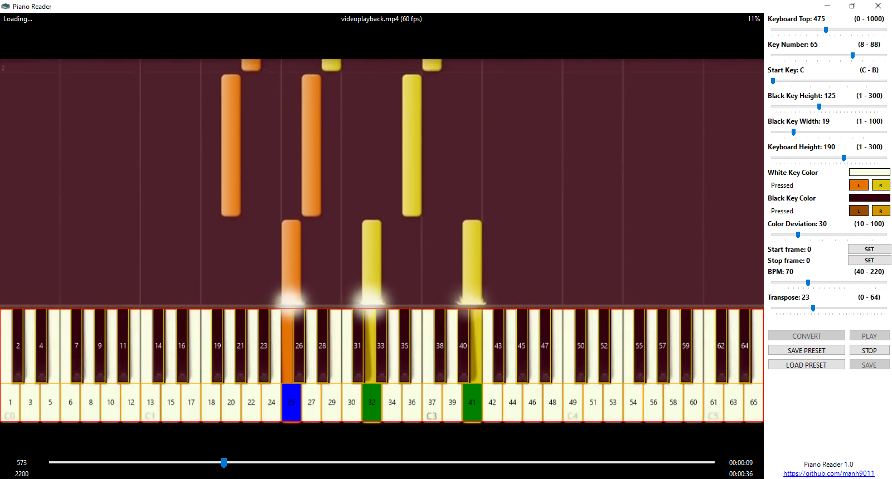

**Piano Reader** is a Windows desktop application written in **C# .NET 9** that converts piano roll videos (such as those rendered by Synthesia or similar software) into playable and editable **MIDI files**.  

It analyzes video frames to detect pressed keys on a virtual piano keyboard, reconstructs the musical notes, and allows you to preview, configure, and export them as MIDI.  



---

## ✨ Features

- 📹 **Input from video**: Load MP4 videos (e.g., Synthesia renders).  
- 🎼 **Automatic note recognition**: Detects key presses and reconstructs MIDI.  
- 🎚 **Configurable detection parameters**: Adjust keyboard size, black/white key colors, deviation thresholds, and more.  
- ⏱ **Tempo control**: Set custom BPM (40–220).  
- 🔀 **Transpose**: Shift notes up or down (0–64 semitones).  
- ▶ **Preview playback**: Play the detected MIDI before saving.  
- 💾 **Save / Load presets**: Store and reload your recognition settings.  
- ⊞ **Windows only**: Built with C# .NET 9, designed for Windows environments.  

---

## 📥 Installation

1. Ensure you have **Windows 10/11** with [.NET 9 Runtime](https://dotnet.microsoft.com/en-us/download/dotnet/9.0) installed.  
2. Download the latest release from the [Releases](../../releases) page.  
3. Extract the archive and run `PianoReader.exe`.  

---

## 🖥 Usage

1. Open **Piano Reader**.  
2. Load a piano-roll MP4 video (e.g., Synthesia render).  
3. Adjust detection parameters on the right-hand panel until keys are recognized correctly.  
4. Set start/stop frames, tempo, and transpose if needed.  
5. Click **Convert** to generate the MIDI.  
6. Preview with **Play**.  
7. Save the final MIDI file with **Save**.  

---

## ⚙️ Parameters Explained

- **Keyboard Top**: Vertical position of the keyboard area (0–1000 px).  
- **Key Number**: Number of keys (8–88).  
- **Start Key**: Left-most key (C–B).  
- **Black Key Height / Width**: Adjust black key dimensions for detection (1–300 / 1–100).  
- **Keyboard Height**: Vertical height of the entire keyboard (1–300).  
- **White / Black Key Color**: Base colors of unpressed keys. Configure pressed state for left/right separately.  
- **Color Deviation**: Tolerance for detecting a pressed key (10–100).  
- **Start / Stop Frame**: Video frame range to process.  
- **BPM**: Tempo for MIDI playback (40–220).  
- **Transpose**: Shift notes up/down by semitones (0–64).  

---

## 🎵 Example Workflow

1. Load a Synthesia MP4 (60 fps recommended for high accuracy).  
2. Adjust **Keyboard Top** and **Key Number** to align with the on-screen keyboard.  
3. Configure **Color Deviation** until pressed keys are detected correctly.  
4. Set **Start Frame** and **Stop Frame** to trim silence.  
5. Click **Convert**, then **Play** to preview.  
6. Save the MIDI file.  

---

## 🚀 Development

- Language: **C#**  
- Framework: **.NET 9 (Windows only)**  
- GUI: **WinForms**  

### Build from source
1. Clone the repository:
   ```bash
   git clone https://github.com/manh9011/PianoReader.git
   cd PianoReader
   ```
   Open in Visual Studio 2022 or newer.

3. Restore NuGet dependencies.

4. Build and run.

## 📜 License

- This project is licensed under the MIT License

## 🙌 Credits

- Developed by manh9011.
- Inspired by Synthesia-style piano roll visualizations.
- Video decoder by OpenCvSharp.
- Midi writer by DryWetMidi.
